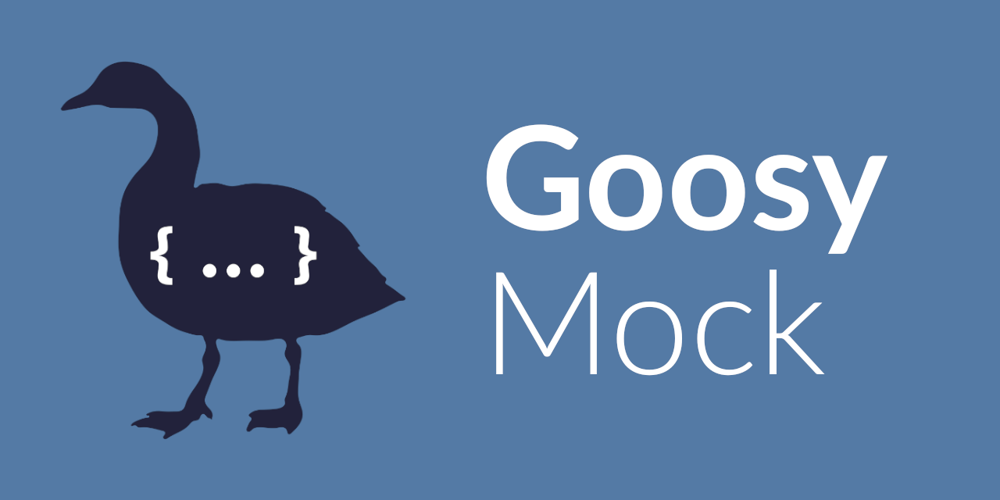

<em>Fully functional API was never an option</em>

---

# GoosyMock

**GoosyMock** is a configurable test service for mocking HTTP responses,
featuring SSL support, dedicated administration API and custom payloads
(binary files that can be served on particular routes). It's also prepared
for Kubernetes deployments (Helm chart), making it easy to adapt and use.

This project is successor to [**GPTS**](https://github.com/Icikowski/GPTS) and
was initially meant to be an improvement over existing solution by introducing
new internal architecture, better approach for serving custom content and
overall improvements to both code's and repository's structure. Changes turned
out to be hard to apply, which led to rewriting whole source code from scratch.

[**Explore documentation**](https://icikowski.github.io/GoosyMock)
